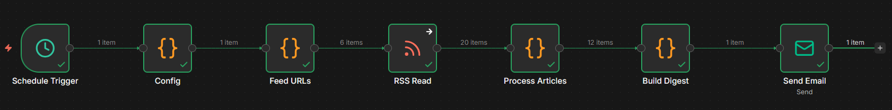

# Monitor RSS feeds for brand and regulatory mentions with rule-based scoring and email digests


An n8n workflow that scans RSS/Atom feeds on a schedule (hourly by default), scores each matching article for relevance, sentiment, and entity tags, and emails an HTML digest grouped by topic. Optional routes send each team or client department a digest filtered to just its own topics.

Built for communications desks that scan the news every morning and route coverage to the departments that need it, without paying for a third-party listening tool.



## How it works

One linear pipeline runs on a schedule (hourly by default) and on demand whenever you click Execute Workflow.

```
Schedule Trigger  →  Config  →  Feed URLs  →  RSS Read  →  Process Articles  →  Build Digest
                  →  Has Matches?  → true  →  Send Email
                                  → false →  Skip Empty Run
```

All the intelligence lives in the Code nodes as pure JavaScript, so the same input always produces the same output. Config returns one object holding every setting. Feed URLs fans out one item per feed and RSS Read fetches each one, so a single broken feed does not stop the rest. Process Articles is the engine: it matches each article against your topics (whole-word, boolean AND on include terms, any exclude term suppresses the topic), scores relevance 0 to 100 from term frequency, source weight, and recency, scores sentiment with an AFINN-style lexicon normalized by article length, tags known entities by alias, and de-duplicates across runs using a hashed seen-list in workflow static data so each article is reported once.

Build Digest renders one HTML email per audience: the full digest to `digest.to`, plus one filtered digest per entry in `digest.routes`. Has Matches? drops any digest with zero matches, so quiet runs send nothing.

## Setup

You need: a self-hosted n8n instance and any SMTP account for sending the digest. No database, no API keys.

### 1. Config

1. Import `workflows/media-monitor.workflow.json` into n8n. It imports inactive; configure before activating.
2. Open the Config node and edit the returned object. At a minimum:

   | Field | What to set |
   |---|---|
   | `feeds` | Your RSS/Atom URLs. |
   | `topics` | Named topics with `include` (all terms must appear) and `exclude` (any match suppresses). Whole-word and case-insensitive, so `include: ["mac"]` does not match inside `macro`. |
   | `entities` | Label to alias list for entity tagging. |
   | `digest.to` / `digest.from` | Full-digest addresses. Set `digest.to` to `""` to send routed digests only. |

### 2. Credential

Open Send Email and assign an SMTP credential (Gmail app password, Postmark, SES, Mailgun, and similar all work). This is the only credential the workflow needs.

### 3. Run

1. Click Execute Workflow. With matches you get a digest email; with none, the run ends at Skip Empty Run.
2. Activate the workflow. The Schedule Trigger then runs hourly; change the interval in the node.

## Day-to-day use

**Read the digest.** Each article is listed under its topic with a relevance badge, a sentiment badge, source, timestamp, a short summary, and entity tags, sorted by relevance.

**Route to a department.** Add an entry to `digest.routes` with a name, a recipient, and the topic names it should receive:

```js
{ name: "Environment Dept", to: "env-comms@example.gov", topics: ["RegulatoryNews"] }
```

That department gets its own email with only those topics, while the full digest still goes to `digest.to`. An article matching two routed topics appears in both emails.

**Quiet runs.** Runs with zero matches are skipped instead of emailed. Set `digest.sendEmpty` to `true` if you would rather receive a "No new matches" email.

**Tune the noise.** Raise `digest.minRelevance` to hide low-scoring items, or adjust the scoring weights in Config.

## What is in the repo

- `workflows/media-monitor.workflow.json`: the importable n8n workflow. This is the source of truth; the Code-node bodies are embedded, with no external requires at runtime.
- `TEMPLATE-DESCRIPTION.md`: the dashboard description used for the n8n template listing.
- `src/lib.mjs`: readable, unit-testable copies of every pure function the workflow uses (`normalizeArticle`, `hashLink`, `matchTopics`, `scoreRelevance`, `scoreSentiment`, `tagEntities`).
- `examples/config.example.js`: a realistic Config body with three named topics, scoring weights, a starter lexicon, and an entity dictionary.
- `scripts/build-workflow.mjs`: regenerates the workflow JSON from `src/lib.mjs` and `examples/config.example.js`. Run after editing either.
- `tests/`: a Node-only self-test plus a smoke test that executes the embedded Code-node bodies.

## Verifying locally

```sh
npm test        # self-test (15 assertions) + smoke test, no n8n needed
npm run check   # confirms the workflow JSON is in sync with the lib and config
npm run build   # regenerates the workflow JSON after editing the lib
```

## Tweaks you might want

- **Per-source trust**: drop a host into `scoring.sources` with a multiplier, e.g. `"yourindustryrag.example": 1.8`.
- **Different cadence**: edit the Schedule Trigger (every N minutes, hours, days, or cron). For weekly digests, raise `recencyHalfLifeHours` toward 168.
- **More sentiment words**: add entries to `lexicon` with an integer score, conventionally -5 to +5.
- **Sheets archive**: the email already groups, scores, and timestamps every match, so no second store is required. If you want a spreadsheet copy, add a Google Sheets node after Process Articles with `operation: append` and `mappingMode: autoMapInputData`; the enriched fields (title, link, source, topics, relevance, sentiment, entities) map straight to columns.

## Constraints

- **Runs on self-hosted n8n.** The enrichment lives in Code nodes (custom JavaScript), and the de-duplication memory uses workflow static data, a small storage area attached to the workflow. Both are available on a self-hosted instance but restricted on some n8n Cloud plans, so this template targets self-hosted.
- **Each node is pinned to a version.** The exported workflow records the exact version of every node it uses (for example the IF node at 2.2). If your n8n is older, it will flag the mismatch when you import. *What to do:* click the one-click fix n8n offers, which adapts the node to the version you have, and carry on.
- **De-duplication is stored inside this one workflow.** The "do not email the same article twice" memory (the seen-list) is held in that workflow's static data on your instance. A freshly imported copy starts with an empty memory, so its very first run treats everything currently in your feeds as new and can send one large digest. *What to do:* run that first execution manually at a quiet time, or temporarily raise `digest.minRelevance` so the opening batch is smaller. It settles from the second run onward.
- **The seen-list only persists on scheduled runs, not manual test clicks.** When the schedule fires the active workflow, the memory is saved and carried forward. When you click Execute Workflow to test, it is not saved between clicks, so the same article can reappear while you experiment. *What to do:* treat repeats during manual testing as normal; real de-duplication begins once the workflow is active and running on its schedule.

## License

MIT. See `LICENSE`.

Built by Kevin Yu ([exekyute](https://github.com/exekyute)).
